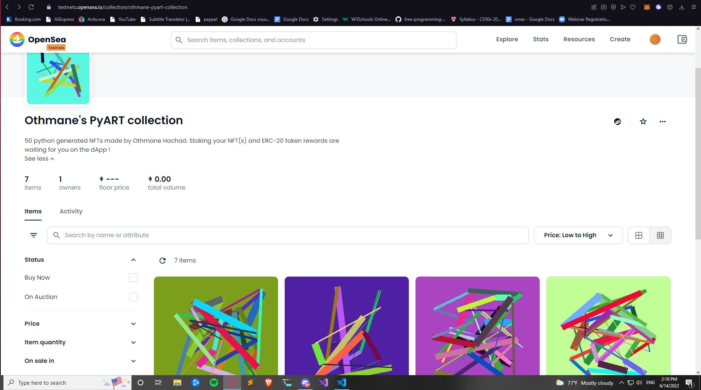
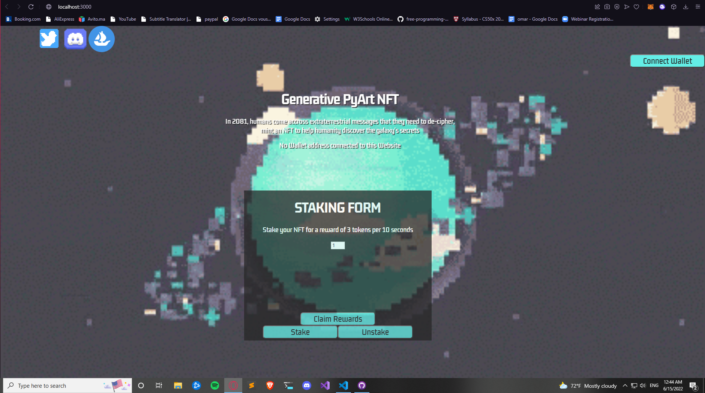

Staking dapp for generative python NFTs

(EDIT) Since The Merge happened, the rinkeby testnet has been deprecatd meaning this repo needs to be updated ! I will try to rec-create it over on the Goerli Test network, it is a chance to make a few adjustments and changes to the smart contracts ! (I will add screenshots to the README to better visualise the work)

This project is for experimenting the creation of a NFT collection from scratch and learning about blokchain development. In this project I wrote a python script which creates random images. We upload the images to ipfs using pinata and then the metadata is generated for each image using a another python script After that we start writing the smart-contracts for minting one of these NFTs, staking them and getting ERC20 token rewards from them. Then we create a simple frontend so that users can mint and stake NFTs, the users can then stake/unstake their NFTs and also claim rewards without unstaking their NFT. To be able to mint you first need to be approved by the smart-contract creator address (mine).

This project is not meant to make any money but only to show my work as a beginner dev !

Check out the collection on opensea-testnet : https://testnets.opensea.io/collection/othmane-hachads-pyart-collection

How to check out the collection's frontend :

clone the repository on your computer
change your working directory to "dapp"
run the following command "npm start"
Have fun minting ! ( dont forget to get faucet eth ;) )

